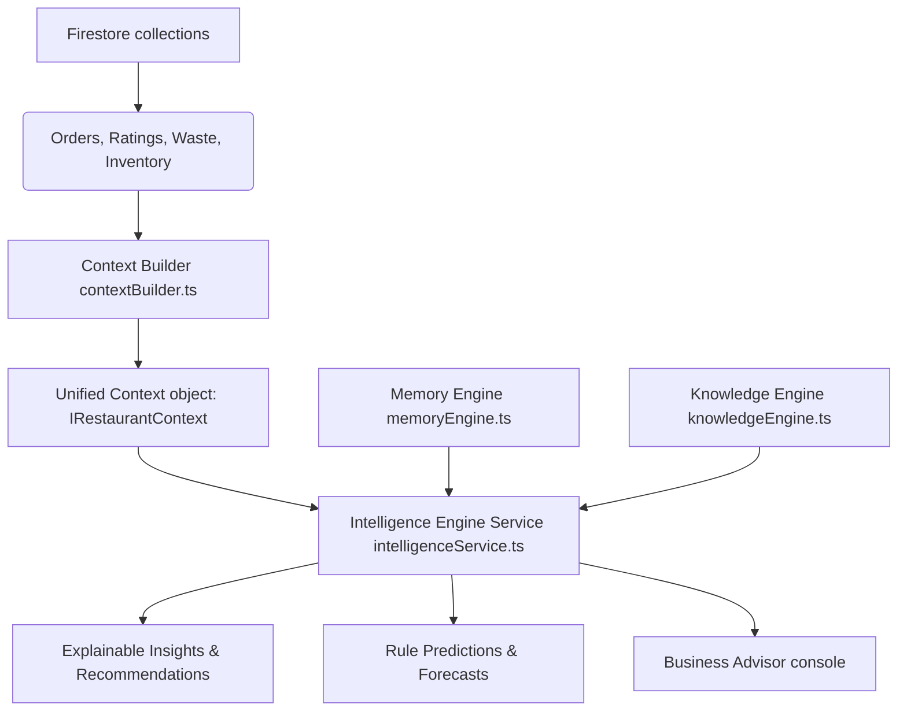

# RestaurantOS Intelligence Engine Architecture

This document describes the design, rules validation models, scoring algorithms, and future AI provider adapter interfaces of the RestaurantOS Intelligence Engine.

---

## 🔍 Context Architecture Flow

---

## 📊 Intelligence Health Score Formulation

The health index ($0 \rightarrow 100$) dynamically gauges the operational and financial health of the restaurant:

$$\text{Health Score} = 90 - \Delta_{\text{CSAT}} - \Delta_{\text{Prep}} - \Delta_{\text{Stock}} - \Delta_{\text{Waste}}$$

### Metric Deduction Penalties ($\Delta$)

1. **CSAT Penalty ($\Delta_{\text{CSAT}}$)**:
   - Average CSAT stars $< 4.2 \rightarrow -15\text{ pts}$.
   - Average CSAT stars between $4.2\text{ and }4.6 \rightarrow -5\text{ pts}$.
   - Average CSAT stars $\ge 4.6 \rightarrow 0\text{ pts}$.

2. **Preparation Turnaround Penalty ($\Delta_{\text{Prep}}$)**:
   - Turnaround latency $> 18\text{ minutes} \rightarrow -15\text{ pts}$.
   - Turnaround latency between $15\text{ and }18\text{ minutes} \rightarrow -5\text{ pts}$.
   - Turnaround latency $\le 15\text{ minutes} \rightarrow 0\text{ pts}$.

3. **Stock Safety Penalty ($\Delta_{\text{Stock}}$)**:
   - Out-of-stock or low stock counts $> 5 \rightarrow -10\text{ pts}$.
   - Out-of-stock or low stock counts between $2\text{ and }5 \rightarrow -5\text{ pts}$.

4. **Spoilage Waste Penalty ($\Delta_{\text{Waste}}$)**:
   - Trailing spoilage value cost $> \$50.00\text{ (Rs 5000)} \rightarrow -10\text{ pts}$.

---

## 🔮 Rule-Based Operational Predictions

The engine computes deterministic predictions with confidence scores based on trailing operations:
- **Weekend Volume Forecast**: Expects order counts using Saturday baseline growth factors ($\text{Confidence: } 85\%$).
- **Kitchen Hour Peaks**: Warns about peak cooking stress slots based on historical ticket clusters ($\text{Confidence: } 90\%$).
- **Customer Turnaround**: Maps seat cover wait timings based on average ratings covers.

---

## 🧠 Memory Patterns & Operational Habits

Accumulates historical habits under `IRestaurantMemory`:
- **Busiest Day**: Identifies the weekday with the maximum order count.
- **Lunch Peak Hour**: Discovers standard lunchtime volume spikes (e.g. 1 PM - 2 PM).
- **Approved Discounts Limit**: Analyzes approved billing offsets to locate maximum discount boundaries.

---

## 🔌 Future AI Provider Integrations Plan

To safely support future LLMs, the platform exposes a generic `IAIProvider` interface under `providers/aiProvider.ts` featuring adapters for:
1. **Gemini Pro (Google)**
2. **GPT-4o (OpenAI)**
3. **Claude 3.5 Sonnet (Anthropic)**
4. **Ollama Local (Local running LLMs)**
5. **DeepSeek Coder (Open Weights LLM)**

These adapters remain mock placeholders, returning instant mock responses to preserve client performance and avoid external dependencies.
