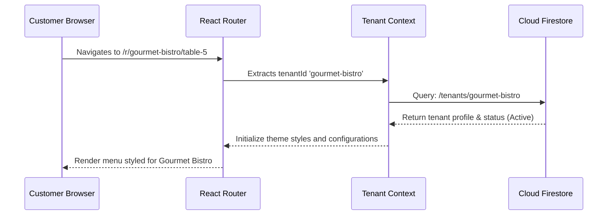
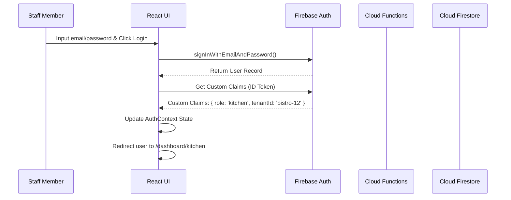
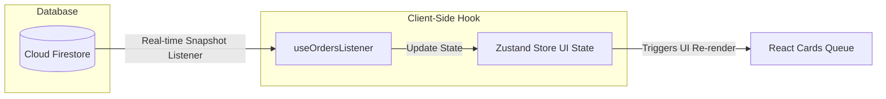
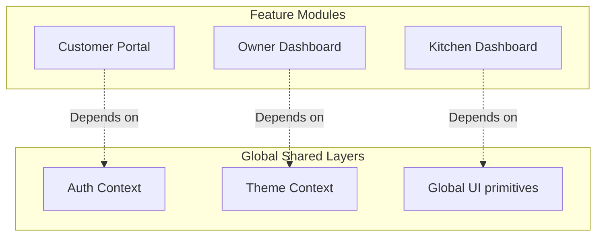
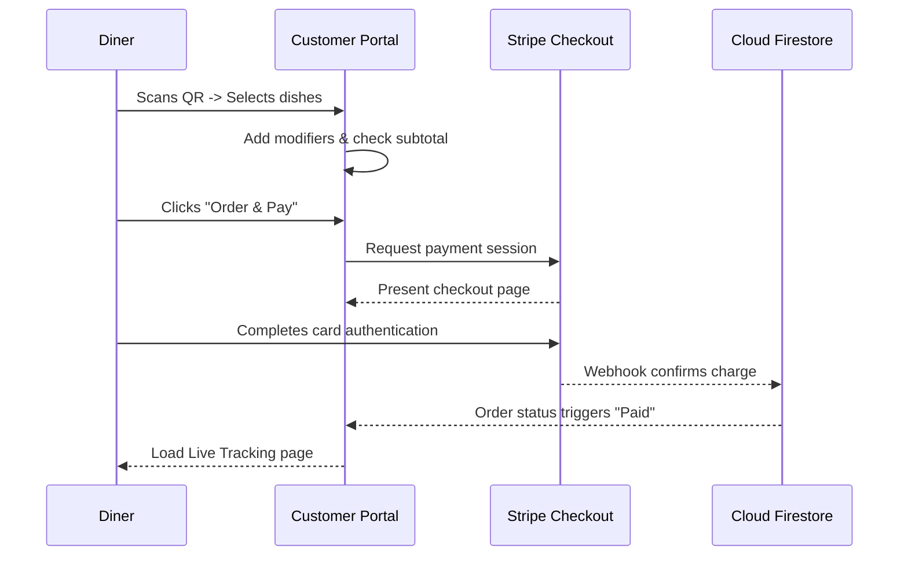
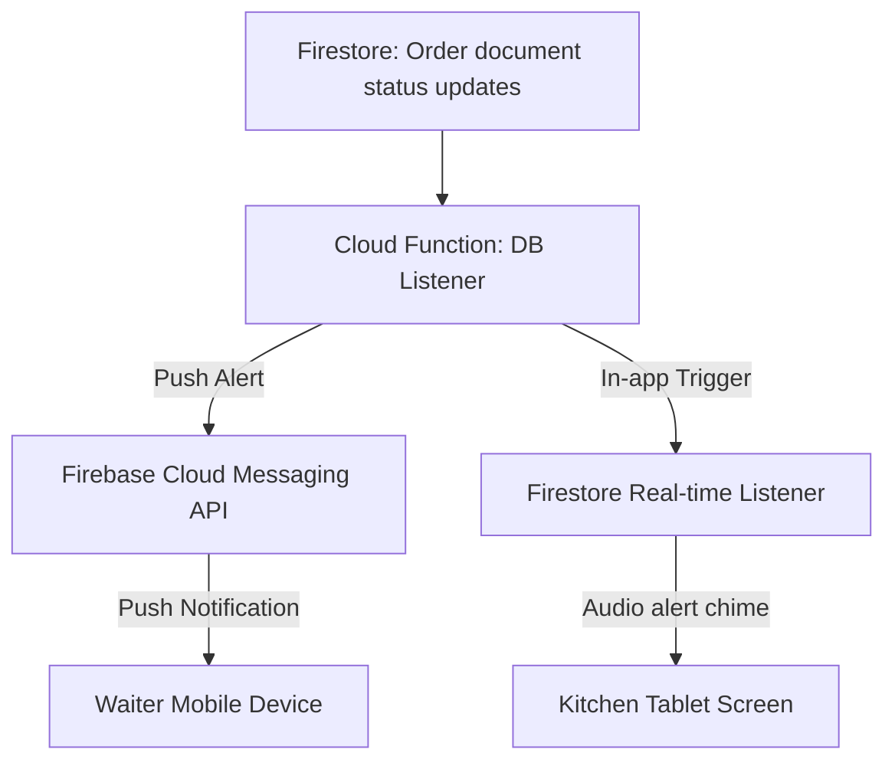
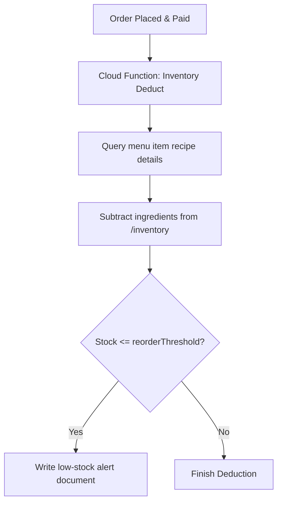
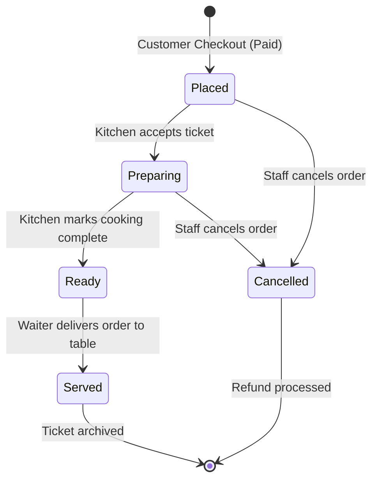
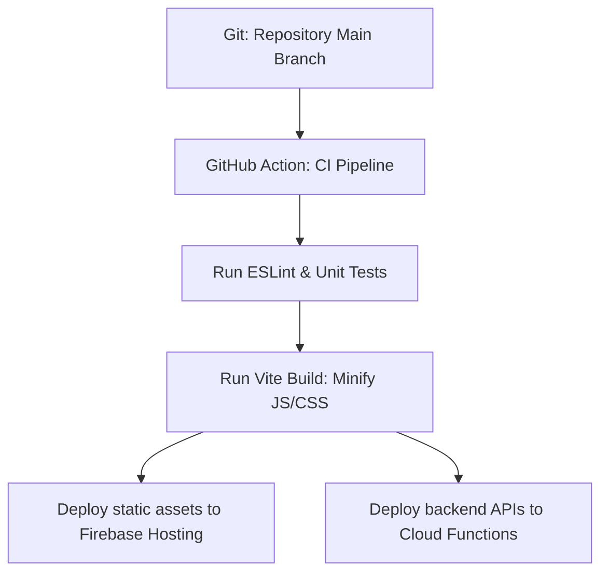

# System Architecture Specification: RestaurantOS

This document specifies the system architecture for **RestaurantOS**—a multi-tenant, commercial-grade SaaS Restaurant Management System. This specification serves as the design blueprint for development teams and AI systems implementing RestaurantOS.

---

## 1. High-Level System Architecture

```mermaid
graph TD
    subgraph Client-Side (SPA)
        UI[React / TS / Vite App]
        Zustand[Zustand Stores]
        AuthContext[Auth Context]
        TenantContext[Tenant Context]
    end

    subgraph CDN & Hosting
        FirebaseHosting[Firebase Hosting CDN]
    end

    subgraph Firebase Serverless Core
        FirebaseAuth[Firebase Auth]
        Firestore[Cloud Firestore DB]
        CloudStorage[Firebase Storage]
        CloudFunctions[Google Cloud Functions]
    end

    subgraph External Platforms
        StripeAPI[Stripe Billing & Payments]
    end

    UI -->|Deploys to| FirebaseHosting
    UI -->|Authenticates| FirebaseAuth
    UI -->|Real-time Sync & CRUD| Firestore
    UI -->|Uploads Media| CloudStorage
    UI -->|Triggers Secure Actions| CloudFunctions
    CloudFunctions -->|Synchronizes Subscriptions| StripeAPI
    UI -->|Redirects Checkout| StripeAPI
```

### Description
RestaurantOS uses a **serverless client-side SPA architecture**. The frontend React application compiles into optimized static assets served via Firebase Hosting's CDN. The client application connects directly to the backend database, authentication, and file storage APIs via the Firebase Client SDK. Secure server-side business logic is isolated in serverless Google Cloud Functions.

### Purpose
To eliminate server hosting, scaling, and connection pooling maintenance, allowing developer resources to focus on UI experience, feature creation, and payment optimization.

### Design Decisions
- **Direct Database Connections**: Client components read/write Firestore documents directly, governed by Firestore Security Rules. This avoids intermediate API controller layers and maintains instant real-time synchronization.
- **Serverless Compute**: Secure transactions (e.g. Stripe checkout creation, staff invitations) run inside Google Cloud Functions to prevent client token exposure.

### Best Practices
- Encapsulate all direct database queries within custom React hooks to isolate database implementation changes from UI rendering logic.

### Future Scalability Considerations
As transaction volume grows, the frontend architecture remains identical. Firestore scales automatically to handle millions of concurrent operations, and Firebase Hosting leverages Edge caching to deliver app scripts globally in milliseconds.

---

## 2. Multi-Tenant Architecture



### Description
RestaurantOS implements a **logical multi-tenancy model** using a shared database instance. Rather than dedicating separate database clusters per merchant, tenant data is co-located in shared collections, logically separated using an indexed `tenantId` string attribute.

### Purpose
To enable scalable merchant onboarding. A single, shared database layout significantly reduces subscription setup times, simplifies global schema upgrades, and reduces cloud compute costs.

### Design Decisions
- **Slug-Based URL Routing**: Tenant identification is parsed from the subdomain or the path namespace (e.g. `/r/:tenantId/*`).
- **Strict Query Enforcement**: All database hooks and services must append a `.where('tenantId', '==', tenantId)` filter.

### Best Practices
- Define the `tenantId` property as a required key in all operational interfaces.
- Enforce tenant isolation boundaries via Firestore Security Rules, verifying that a user's authenticated custom claim `tenantId` matches the document resource data.

### Future Scalability Considerations
Logical partitioning allows for database-wide aggregation, making platform analytics (such as global average order values) simple to compute without complex cross-database queries.

---

## 3. Authentication Flow



### Description
Authentication is managed via **Firebase Authentication**. Staff credentials (emails, passwords, login sessions) are exchanged for JSON Web Tokens (JWT). Roles and tenant scopes are stored as custom claims inside the JWT.

### Purpose
To delegate credential verification, session management, password hashing, and token renewals to a secure, industry-standard identity provider.

### Design Decisions
- **Custom Claims Integration**: User roles (`owner`, `waiter`, `kitchen`, etc.) and `tenantId` variables are injected into JWT tokens via serverless cloud functions upon user signup or invitation.
- **Client Session Persistence**: Session persistence uses `local` storage to keep staff logged in across device restarts.

### Best Practices
- Never store role mappings or tenant associations in client-side cookies or plain localStorage values.
- Rely on Firebase Auth's ID token validation on the backend to decode custom claims.

### Future Scalability Considerations
Using standard JWT claims allows for seamless future integration with federated identity systems (OAuth, Google Workspace SSO, SAML) if enterprise hospitality groups adopt the platform.

---

## 4. Authorization (RBAC)

### Description
Access control uses Role-Based Access Control (RBAC). Dashboards and database operations are gated based on user roles (`super-admin`, `owner`, `admin`, `waiter`, `kitchen`, `customer`).

### Purpose
To restrict resource access to authorized personnel, protecting restaurant business data and preventing customers from accessing operational staff views.

### Design Decisions
- **Custom Route Guards**: React layouts verify custom claims before mounting.
- **Firestore Verification**: Database access rules validate roles at the document level:
  `allow write: if request.auth.token.role == 'owner'`.

### Best Practices
- Use a single, unified `ProtectedRoute.tsx` wrapper for client-side routing.
- Keep security rules simple and modular by isolating validation logic into helper functions.

### Future Scalability Considerations
Roles can be customized at the tenant level (e.g. creating a custom "Shift Supervisor" role) by mapping dynamic action permissions inside a `/roles` subcollection.

---

## 5. Firestore Data Flow



### Description
Data synchronization between client dashboards and the database uses **Firestore Snapshot Listeners**. Real-time changes are synchronized down to the client layout state without polling.

### Purpose
To enable instant coordination between customer checkouts, kitchen cooking lines, and table servers.

### Design Decisions
- **Snapshot Caching**: Use Firestore's offline persistency cache to load initial states immediately.
- **Optimized Subscriptions**: Snapshot listeners subscribe only to documents matching the active `tenantId` and operational status flags (e.g. `status == "preparing"`).

### Best Practices
- Always return the snapshot unsubscribe function in React's `useEffect` cleanup block to prevent memory leaks and duplicate connection count charges.

### Future Scalability Considerations
If active query volumes exceed connection limits, a caching layer using Redis on a Node proxy or database write-batching can be introduced.

---

## 6. Component Architecture

### Description
The frontend adopts a component hierarchy split into presentational primitives, shared layouts, and feature-driven modules.

### Purpose
To decouple UI styles from data services, ensuring components are reusable, maintainable, and testable.

### Design Decisions
- **Stateless Base UI Components**: Components in `components/ui/` do not write to or fetch from databases. They receive callbacks and parameters only via props.
- **Atomic File Layout**: CSS, TS interfaces, and component files are kept in a single folder per component.

### Best Practices
- Define component props interfaces explicitly.
- Pass class modifiers using the custom Tailwind CSS merge utility (`cn`).

### Future Scalability Considerations
Isolating components into a stateless `components/ui/` folder simplifies porting the UI library into an independent package (e.g., Storybook or private npm registry) for future mobile apps.

---

## 7. Folder Architecture

### Description
The directory layout organizes files by **business feature modules** under `src/features/`, rather than by technical layers (e.g., mixing all page files in a global `/pages` folder).

### Purpose
To localize developer changes, reduce merge conflicts, and keep related code colocated.

### Design Decisions
- Group domain logic under dedicated folders (`features/customer-portal/`, `features/kitchen-dashboard/`, etc.).
- Maintain global shared concerns (auth, theme data contexts, database configurations) in dedicated root directories (`/context`, `/services`, `/config`).

### Best Practices
- Components inside a feature folder must never import components directly from another feature folder. Shared components must be moved to the global `/components` folder.

### Future Scalability Considerations
This module separation allows development teams to split ownership of specific dashboards (e.g. one team owns `kitchen-dashboard` and another owns the consumer `customer-portal`) with minimal overlap.

---

## 8. Feature-Based Module Architecture



### Description
Each business module in `src/features/` acts as an isolated application layer. It exports a root feature component (or layout) that mounts to specified routing paths.

### Purpose
To prevent feature coupling, making code modifications easy to manage.

### Design Decisions
- **Independent Context Hooks**: A feature's internal state (e.g., the kitchen order filter state) is managed within that feature's folder using local custom hooks or stores.

### Best Practices
- Keep components focused on a single responsibility.
- Place feature-specific utility formatters inside a `utils/` subdirectory inside that feature's folder.

### Future Scalability Considerations
If a feature dashboard grows excessively large, it can be lazy-loaded using React dynamic imports (`React.lazy`) to minimize initial JS bundle load sizes.

---

## 9. State Management Strategy

### Description
State management is split into three levels:
1. **React State (`useState`, `useReducer`)**: For isolated component-level states.
2. **Zustand Stores**: For global frontend-only states (e.g. cart configurations, toast notifications).
3. **React Context**: For application configurations that change infrequently (e.g. Authentication, Tenant metadata).

### Purpose
To optimize re-render patterns, maintain high client performance, and minimize boilerplate code.

### Design Decisions
- **Zustand for Global State**: Zustand stores are created without React context providers, avoiding deep component nesting and performance bottlenecks from context re-renders.

### Best Practices
- Use Zustand selectors (`useCartStore(state => state.items)`) to subscribe components only to the specific slices of state they need.

### Future Scalability Considerations
Zustand stores can be persisted to `localStorage` automatically using middleware, allowing customer cart states to persist across browser reloads.

---

## 10. Service Layer Design

### Description
The service layer (`src/services/`) abstracts interactions with external systems (Firestore database calls, Stripe payment requests, Firebase Storage assets uploads).

### Purpose
To insulate the application from external SDK changes and enable isolated unit testing.

### Design Decisions
- **Client Wrappers**: Service modules export typed objects that wrap Firebase SDK API calls.
- **Dumb Controllers**: Component event triggers invoke service methods rather than calling Firebase methods directly.

### Best Practices
- Restrict direct database writes to the service layer. Components should not construct raw Firestore queries.

### Future Scalability Considerations
If the backend transitions to a GraphQL or custom REST API, the frontend UI components can remain unchanged. Only the service layer implementation needs to be updated.

---

## 11. Firebase Integration Strategy

### Description
Firebase services are initialized in `src/config/firebase.ts`. The SDK is configured with offline capability enabled to allow operation during network dropouts.

### Purpose
To provide a single point of initialization for Firebase SDKs and configure offline caching for improved resilience.

### Design Decisions
- **Enable IndexedDb Caching**: Firestore data caching is configured during database initialization.
- **Client SDK Lifecycle**: Initialize services once at boot time and export them as singletons.

### Best Practices
- Never hardcode API keys inside components. Load Firebase configurations from environment variables (`.env`).

### Future Scalability Considerations
Firebase SDK configurations can be adjusted to route database queries through a regional load balancer if global data locality rules require routing traffic to specific geographical nodes.

---

## 12. Routing Architecture

### Description
Client routing uses nested paths managed via `react-router-dom` (v6+). Protected routes are wrapped in authorization layout shells.

### Purpose
To manage page routing and secure layouts using role-based access checks.

### Design Decisions
- **Nested Layout Shells**: Render parent layout shells (containing Sidebars, Headers, Alerts trackers) containing child routes inside `<Outlet />` tags.
- **Dynamic Role Checking**: Route guards intercept unauthenticated sessions and redirect them to `/login`.

### Best Practices
- Define all routes in a single, centralized route matrix file (`src/routes/AppRoutes.tsx`).
- Use relative paths in nested routing parameters to ensure portability.

### Future Scalability Considerations
The routing config can import dashboard layouts dynamically, split bundle files by route target, and optimize initial page-load speeds.

---

## 13. Dashboard Architecture

### Description
Dashboards utilize a responsive grid layout. A shared base structure imports custom widgets based on the user's role.

### Purpose
To provide a consistent UI shell for operational staff while displaying tools relevant to their specific role.

### Design Decisions
- **Shell Layout**: Dashboards feature a left sidebar navigation on desktop, shifting to a bottom navigation bar on mobile.
- **Dynamic Navigation Options**: Sidebar navigation links render dynamically based on user role metadata.

### Best Practices
- Implement skeleton loaders in dashboard panels to maintain UI layout stability while data fetches complete.

### Future Scalability Considerations
Widgets can be made drag-and-drop customizable by saving panel order arrays inside the user's configuration document.

---

## 14. Customer Flow



### Description
The customer flow is optimized for mobile browser performance, routing diners from QR code scans directly to menu browsing and tableside checkouts without requiring account registration.

### Purpose
To minimize friction during ordering, maximizing tableside order volume and average guest spend.

### Design Decisions
- **Anonymous Sessions**: Customers browse anonymously. An auth session is silently created via Firebase Auth Anonymous Login on checkout to track order history.
- **Stripe Checkout Redirect**: Payments run on Stripe-hosted checkout pages to simplify compliance and support digital wallets.

### Best Practices
- Persist the cart state to local storage so items remain in the cart if the browser is accidentally closed.

### Future Scalability Considerations
The customer flow can easily adapt to handle group ordering by sync-merging cart documents in Firestore under a shared `tableId` parent key.

---

## 15. Owner Flow

### Description
The Owner Flow is a desktop-first operational dashboard layout optimized for restaurant management, reports analysis, staff coordination, and subscription management.

### Purpose
To provide business owners with a centralized portal to monitor and manage their restaurant operations.

### Design Decisions
- **Interactive Visualizations**: Analytics charts compile daily/monthly data via Recharts library grids.
- **Modular Editors**: Menu additions use split forms separating image uploads from text parameters.

### Best Practices
- Paginate sales logs queries to avoid downloading huge document sets onto the client machine.

### Future Scalability Considerations
Owner reports can connect to external accounting services (e.g. QuickBooks) via background functions triggered on Stripe invoice updates.

---

## 16. Kitchen Flow

### Description
The Kitchen Flow is designed for landscape touchscreens mounted in food prep areas, featuring large layout panels, real-time ticket cards, and sound notifications.

### Purpose
To coordinate food prep queues and keep the cooking line in sync with wait staff and diners.

### Design Decisions
- **Touch-Friendly Controls**: Order status changes trigger via large button cards.
- **Audio Alerts**: Play distinct alarm sounds on new order entries or long-overdue tickets.

### Best Practices
- Restrict details inside the ticket view to essential cooking specs, modifications, and order timers.

### Future Scalability Considerations
The Kitchen flow can integrate with multiple prep stations (e.g., separating hot food tickets to a grill screen and cold food tickets to a salad station) by filtering tickets by category keys.

---

## 17. Waiter Flow

### Description
The Waiter Flow is optimized for handheld tablets used by wait staff, displaying a visual map of table layouts and current table statuses.

### Purpose
To help servers coordinate tableside service, enter manual orders, and manage checkout payments.

### Design Decisions
- **Visual Table Layout**: A grid matrix displays tables with color-coding indicating customer requests (e.g., service, water, bill).
- **Manual POS Module**: A slide-over panel allows waiters to enter orders for guests without smartphones.

### Best Practices
- Automatically clear table calls once a waiter flags the request as "Addressed" in the system.

### Future Scalability Considerations
The seating map can support customizable drag-and-drop layouts to match changes in the physical restaurant dining room.

---

## 18. Admin Flow

### Description
The Admin Flow targets physical branch managers. It handles shift scheduling, menu updates, and local branch auditing records.

### Purpose
To manage daily operations and configurations at the branch level.

### Design Decisions
- **Immutable Audit Logging**: Write system changes (e.g. employee permissions updates, menu price changes) to `/audit_logs`.
- **Shift Planner Calendar**: Interactive calendar interface to schedule staff shifts.

### Best Practices
- Separate corporate owner settings (like Stripe payouts configurations) from branch administrator configurations.

### Future Scalability Considerations
Manage multi-location supply lines by linking branch schedules to localized inventory depletion levels.

---

## 19. Super Admin Flow

### Description
The Super Admin Flow is the master administrative portal for SaaS operators to manage the RestaurantOS platform.

### Purpose
To monitor SaaS business performance, manage merchant workspaces, and check platform health metrics.

### Design Decisions
- **Unified Tenant Index**: List and filter all onboarded tenants.
- **Tenant Access Override**: Controls to suspend workspaces, bypass subscription tiers, or adjust database usage limits.

### Best Practices
- Secure Super Admin route definitions with multi-factor authentication requirements.

### Future Scalability Considerations
The Super Admin dashboard can connect to system warning alerts to notify operators when Firestore read/write spikes exceed budget limits.

---

## 20. Notification Architecture



### Description
Notifications coordinate operations via real-time browser alerts and system push notifications:
1. **In-App Visual/Audio Alerts**: Triggered via Firestore real-time listeners.
2. **Push Notifications**: Managed via Firebase Cloud Messaging (FCM).

### Purpose
To alert kitchen, wait staff, and customers of order status updates and tableside service requests.

### Design Decisions
- **Audible Alerts**: Kitchen screens play distinct sound files on new order arrivals.
- **FCM for Waiters**: Send background push notifications to waiter devices using FCM service worker scripts.

### Best Practices
- Request browser notification permissions during user onboarding. Implement a manual volume-test button on kitchen screens.

### Future Scalability Considerations
The notifications architecture can extend to send automated SMS updates to customers via Twilio integration when their table order is ready.

---

## 21. Inventory Workflow



### Description
The inventory workflow tracks raw ingredient stock counts and warns kitchen staff when supplies run low.

### Purpose
To prevent menu items from being ordered when the physical ingredients are depleted.

### Design Decisions
- **Deduction Triggers**: Ingredient counts are deducted when a paid order document is created.
- **Availability Toggles**: If an ingredient stock count drops to zero, the system automatically flags all linked menu items as "Unavailable".

### Best Practices
- Run stock deductions inside Firestore transactions to prevent race conditions during busy shifts.

### Future Scalability Considerations
Integrate with supplier APIs to automatically draft purchase orders when ingredient counts drop below reorder thresholds.

---

## 22. Order Lifecycle



### Description
The order lifecycle manages the states an order transitions through, from initial placement to final service and archiving.

### Purpose
To track order progress and coordinate tasks between customers, kitchen crew, and wait staff.

### Design Decisions
- **Linear Status Transitions**: Orders follow a strict status flow (`placed` -> `preparing` -> `ready` -> `served`).
- **Audit Trails**: Every status transition logs the modifying user ID and a timestamp in an `history` array within the order document.

### Best Practices
- Validate status transitions in Firestore security rules to prevent invalid updates (e.g. transitioning an order directly from `placed` to `served`).

### Future Scalability Considerations
Archived orders can be moved to cold storage (BigQuery) daily to control database size and reduce active Firestore read limits.

---

## 23. Analytics Pipeline

### Description
The analytics pipeline aggregates transactional data to display operational metrics on the Owner and Super Admin dashboards.

### Purpose
To provide merchants and SaaS operators with actionable business intelligence.

### Design Decisions
- **Decoupled Aggregations**: Compute summary statistics (such as daily sales totals) asynchronously via Cloud Functions, rather than querying raw sales documents on client devices.
- **Scheduled Aggregations**: Run aggregation scripts nightly and save the summaries to a `/daily_reports` collection.

### Best Practices
- Never run calculations on large datasets directly in the browser. Always query pre-aggregated reports.

### Future Scalability Considerations
Connect the daily reports database to BigQuery for deep analytics queries, business intelligence reporting, and machine-learning predictions.

---

## 24. Error Handling Architecture

### Description
The error handling architecture uses React Error Boundaries, global catch-blocks, and toast notifications to handle exceptions gracefully.

### Purpose
To prevent application crashes from interrupting restaurant operations and guide users with helpful error messages.

### Design Decisions
- **React Error Boundaries**: Wrap major dashboard views in error boundaries to isolate component errors and present standard fallback layouts.
- **Toast Notifications**: Display non-fatal errors (e.g. connectivity drops, field validation errors) using toast messages.

### Best Practices
- Standardize user-facing error messages to be helpful and actionable (e.g. "Payment failed. Please verify card details" rather than "Error 500: Database write exception").

### Future Scalability Considerations
Error logging hooks can integrate with reporting services to automatically page on-call support engineers when application crash rates spike.

---

## 25. Logging Architecture

### Description
The logging architecture records application events and errors:
1. **Security & System Changes**: Written to Firestore `/audit_logs`.
2. **App Crashes & Diagnostics**: Logged to Sentry.
3. **Stripe & Webhook logs**: Monitored in Cloud Functions logs.

### Purpose
To provide developers and admins with diagnostic logs to debug system issues.

### Design Decisions
- **Structured JSON Logs**: Cloud Functions use structured JSON logs (`console.error`, `console.info`) to integrate with Google Cloud Logging.

### Best Practices
- Never log sensitive user information (passwords, complete credit card numbers, tax IDs).

### Future Scalability Considerations
Log collection pipelines can run log analysis scripts to automatically identify common bugs and UX friction points.

---

## 26. Security Architecture

### Description
Security uses HTTPS, JWT validations, strict CORS configurations, and Cloud Functions sanitizers.

### Purpose
To protect tenant business data and payment information.

### Design Decisions
- **Firestore Access Isolation**: Verified via rules checking custom token claims.
- **Stripe PCI Compliance**: Keep payment card transmission code outside the application codebase by delegating to Stripe Elements.

### Best Practices
- Conduct regular audits of Firestore security rules.
- Sanitize input parameters in Cloud Functions to protect against injection issues.

### Future Scalability Considerations
The security configuration is prepared to support SSO integrations for enterprise clients without changing backend security verification patterns.

---

## 27. Scalability Strategy

### Description
The scalability strategy leverages database denormalization and efficient caching to support growing user and transaction volumes.

### Purpose
To maintain low response times and database operational costs as user counts grow.

### Design Decisions
- **Data Denormalization**: Denormalize dynamic parameters (like menu item pricing) directly into order documents. This avoids expensive client join queries.
- **Client-Side Caching**: Cache static configuration documents (such as restaurant profiles and menu categories) on the client.

### Best Practices
- Monitor collection indices to verify database queries run efficiently.

### Future Scalability Considerations
If collection reads scale beyond Firestore thresholds, read operations can route through a Redis cache cluster deployed on Google Cloud Run.

---

## 28. Deployment Architecture



### Description
Deployments are managed via a CI/CD pipeline (e.g. GitHub Actions) that builds static assets and deploys them to Firebase Hosting, and deploys API scripts to Cloud Functions.

### Purpose
To automate deployment processes and ensure only tested and verified code reaches production environments.

### Design Decisions
- **Staged Environments**: Maintain isolated environment projects (`development`, `staging`, `production`) in Firebase.
- **Automated Minification**: Build configurations compile, tree-shake, and compress assets to optimize client-side bundle sizes.

### Best Practices
- Never commit environment secrets (`.env`) to repository source code. Inject configurations during the deployment pipeline.

### Future Scalability Considerations
Hosting deployments can scale to support custom subdomains for tenants using Firebase Hosting API integrations.

---

## 29. Shared Architecture Updates (v1.2)

### Description
In RestaurantOS v1.2, the codebase underwent a major architectural refactoring sprint to improve maintainability, scalability, and code reuse. This decoupled features into client applications (`apps/`) and a centralized shared library (`src/shared/`).

### Folder Layout
- `src/shared/domain/`: Centralized domain models, types, and schemas (e.g., `users`, `restaurant`, `menu`, `orders`, `billing`, `tables`, `staff`, `events`, `notifications`, `customer`, and `tasks`).
- `src/shared/ui/`: Centralized, highly polished, and responsive reusable UI primitives (buttons, cards, dialogs, forms/inputs, tables, badges, avatars, feedback, skeletons, empty-states, layouts) and the centralized `ActivityFeed` component.
- `src/shared/design-system/`: Design system tokens (`tokens.ts`) and CSS classes/variables (`styles.css`) feeding Tailwind configuration for unified styling and themes.
- `src/shared/hooks/`: Reusable hooks such as `useFirestore`, `useRealtime`, `useCurrentUser`, `useCurrentRestaurant`, and `useCurrentBranch`.
- `src/shared/services/`: Unified backend services layer (e.g., `menuService`, `billingService`, `tableService`, `orderService`, `notificationService`, `eventService`, `taskService`).

### Purpose
- Centralize all typescript declarations, domain definitions, validation logic, and styling tokens.
- Decouple generic view presentation components from core domain state services.
- Guarantee full backward-compatibility through proxy exports, allowing zero-downtime developer transitions.
