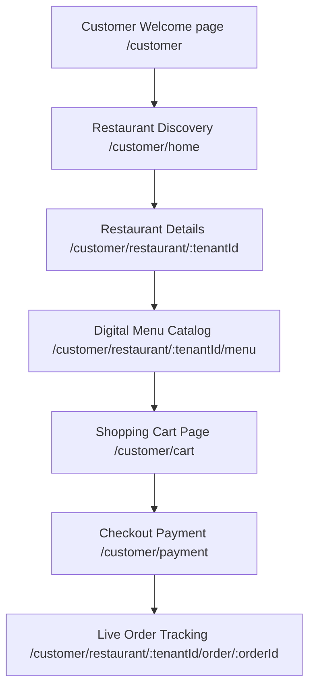

# Customer Portal: RestaurantOS Diner Experience

This document specifies the screens, client layouts, data sources, and business rules of the mobile-first customer-facing application of **RestaurantOS** (v2.0-rc).

---

## 1. Customer Portals & Screens

---

## 2. Screen Reference Directory

### Welcome Screen (`CustomerWelcome.tsx`)
* **Purpose**: Marketing landing and entry gate for diners accessing the web app.
* **Data Source**: None (Static UI elements).
* **Business Logic**: Links to logins/registers and features table QR redirect triggers.

### Restaurant Discovery (`RestaurantDiscovery.tsx` / `CustomerHome.tsx`)
* **Purpose**: Lists onboarded restaurant branches with details.
* **Data Source**: Firestore `/tenants` root collection.
* **Search & Filters**: Users search restaurant names, cuisine filters, ratings sorting, and distance calculators.
* **Business Logic**: Evaluates active opening hours and displays "Open Now" or "Closed" badges dynamically.

### Restaurant Details (`RestaurantDetails.tsx`)
* **Purpose**: Displays selected branch cover graphics, ratings reviews, and seat reservation schedules.
* **Firestore Collections**: `/tenants/{tenantId}`, `/restaurants/{tenantId}/tables`.
* **Business Logic**: Lists available seating capacities and allows users to click a table to check occupancy states.

### Digital Menu (`CustomerMenu.tsx`)
* **Purpose**: Primary menu catalog browser.
* **Firestore Collections**:
  - `/restaurants/{tenantId}/menu/default/categories`
  - `/restaurants/{tenantId}/menu/default/items`
* **UI Components**: Sticky category anchors scroll bars, vegetarian toggles, customization drawer modals.
* **Up-Selling Logic**: Incorporates `recommendationEngine.ts` rules to display items tagged as "Recommended" or "Bestsellers" at the top of the grid.
* **Customization Option groups**: Modals allow side replacements and add-ons selection, with prices computed in cents.

### Shopping Cart (`CartPage.tsx`)
* **Purpose**: Lists item selections, notes, and totals.
* **State Manager**: Zustand store backed by `localStorage` persistence.
* **Calculation Rules**:
  - `Subtotal` = Sum of (Item base price + selected options pricing) * Item quantity.
  - `Tax` = `Subtotal` * restaurant taxRate (e.g. GST 5%).
  - `Service Charge` = `Subtotal` * restaurant serviceCharge percentage (e.g. 5%).
  - `Grand Total` = `Subtotal` + `Tax` + `Service Charge`.

### Checkout & Payments (`PaymentPage.tsx` / `Payment.tsx`)
* **Purpose**: Interface for credit card checkouts.
* **Integrations**: Stripe Elements.
* **Business Logic**: Upon transaction success, writes a new document to `/restaurants/{tenantId}/orders` with status `'placed'` and paymentStatus `'paid'`. The cart is wiped, and the user routes to order tracking.

### Live Dining & Tracking (`OrderTracking.tsx` / `LiveDining.tsx`)
* **Purpose**: Real-time progress tracker for table orders.
* **Data Source**: Firestore snapshot listener on `/restaurants/{tenantId}/orders/{orderId}`.
* **UI Timeline**: Highlights steps dynamically:
  - `Placed`: Order Received.
  - `Preparing`: Cook accepted.
  - `Ready`: Dish cooked and waiting for pick-up.
  - `Served`: Dish delivered to table.
* **Interactions**: Floating buttons to **Call Waiter** (writes assistance alerts) and check **Live Bill** (sums totals across all orders placed by table).

### Diner Profile & Rewards (`ProfilePage.tsx` / `RewardsPage.tsx`)
* **Purpose**: Handles client profiles, order history, and loyalty program details.
* **Firestore Collections**: `/users/{uid}`, `/users/{uid}/reservations`.
* **Loyalty Points Logic**: Diners accumulate 10 points per dollar spent. They can redeem points for rewards coupons (e.g. Free Dessert, Free Soft Drink) which updates their points balance in Firestore.
