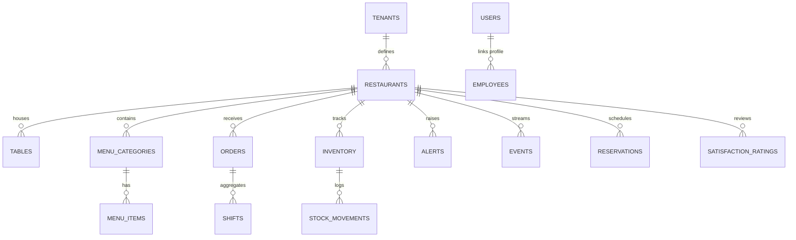

# Firestore Database Schema Specification: RestaurantOS

This document specifies the database structure of **RestaurantOS** (v2.0-rc) hosted on Google Cloud Firestore. The database implements a multi-tenant layout partitioned using logical tenant paths.

---

## 1. High-Level Entity Relationship Diagram



---

## 2. Root Collections

### Collection: `tenants`
Stores corporate profiles, operational metadata, subscription levels, and Stripe details for each restaurant account.
* **Path**: `/tenants/{tenantId}`
* **Schema**:
```typescript
interface ITenant {
  id: string;                         // Unique URL slug or UUID (e.g. 'bella-italia')
  name: string;                       // Restaurant name
  cuisine: string;                    // Primary cuisine category
  description: string;                // Short promo description
  logoUrl: string;                    // URL to banner/logo in Firebase Storage
  status: 'active' | 'suspended' | 'trial';
  planTier: 'starter' | 'pro' | 'enterprise';
  address: {
    street: string;
    city: string;
    zipCode: string;
    country: string;
  };
  contact: {
    phone: string;
    email: string;
  };
  settings: {
    currency: string;                 // (e.g. 'USD', 'INR')
    timezone: string;                 // (e.g. 'Asia/Kolkata')
    taxRate: number;                  // Tax percentage in decimal (e.g. 5.0 for 5%)
    serviceCharge: number;            // Service charge percentage (e.g. 5.0 for 5%)
  };
  stripeCustomerId: string;           // Stripe API customer ID
  stripeSubscriptionId: string;       // Active subscription session ID
  createdAt: string;                  // ISO 8601 timestamp
  updatedAt: string;                  // ISO 8601 timestamp
}
```
* **Security Rules**: Readable by any authenticated user. Writable by owners of that tenant or super-admins.

### Collection: `users`
Contains profiles and authentication mappings for staff members, owners, and customers.
* **Path**: `/users/{userId}`
* **Schema**:
```typescript
interface IUser {
  uid: string;                        // Maps to Firebase Auth UID
  email: string;
  fullName: string;
  displayName?: string;
  tenantId: string;                   // Empty for super-admins; links staff to restaurants
  role: 'super-admin' | 'owner' | 'admin' | 'manager' | 'cashier' | 'reception' | 'waiter' | 'kitchen' | 'customer';
  status: 'active' | 'inactive';
  phoneNumber?: string;
  loyaltyPoints?: number;             // Cumulative reward balance (for customers)
  createdAt: string;
}
```
* **Security Rules**: Read/write allowed by owner of the profile, tenant owner, or super-admin.

### Collection: `employees`
Roster records for invited employees before they activate their profiles.
* **Path**: `/employees/{employeeId}`
* **Schema**:
```typescript
interface IEmployeeInvitation {
  id: string;
  email: string;
  fullName: string;
  role: 'admin' | 'manager' | 'cashier' | 'reception' | 'waiter' | 'kitchen';
  status: 'invited' | 'active' | 'suspended' | 'archived';
  tenantId: string;
  invitationCode: string;             // Unique activation code hashed
  createdAt: string;
  activatedAt?: string;
}
```
* **Security Rules**: Readable by any staff user to fetch invitations by email. Managed by owners or super-admins.

---

## 3. Subcollections under `restaurants/{tenantId}`

The `/restaurants` document acts as the subcollection root for all restaurant-specific operations.

### Collection: `tables`
Maintains seating coordinates and current occupancy indicators.
* **Path**: `/restaurants/{tenantId}/tables/{tableId}`
* **Schema**:
```typescript
interface ITable {
  id: string;
  number: string;                     // (e.g. 'Table 1', 'Bar 4')
  seatingCapacity: number;
  status: 'empty' | 'occupied' | 'service_requested' | 'bill_requested' | 'dirty' | 'cleaning' | 'disabled';
  activeOrderId?: string;             // Reference to the active order document
  qrCodeUrl?: string;                 // URL to download table QR
  floorId: string;                    // (e.g. 'ground-floor', 'rooftop')
  positionX: number;                  // 2D grid X coordinate percentage (0-90)
  positionY: number;                  // 2D grid Y coordinate percentage (0-90)
  shape: 'circle' | 'square' | 'rectangle';
  createdAt: string;
}
```

### Collection: `orders`
Real-time operational orders.
* **Path**: `/restaurants/{tenantId}/orders/{orderId}`
* **Schema**:
```typescript
interface IOrder {
  id: string;
  tenantId: string;
  tableId: string;
  customerId?: string;
  waiterId?: string;
  items: {
    itemId: string;
    name: string;
    count: number;
    notes?: string;
    selectedChoices: {
      optionName: string;
      choiceName: string;
      priceModifier: number;          // In cents
    }[];
    pricePerUnit: number;             // Price in cents snapshotted at purchase time
  }[];
  subtotal: number;                   // In cents
  tax: number;                        // In cents
  serviceCharge: number;              // In cents
  discount: number;                   // In cents
  total: number;                      // Final checkout sum in cents
  status: 'placed' | 'preparing' | 'ready' | 'served' | 'cancelled' | 'archived';
  paymentStatus: 'pending' | 'paid' | 'failed' | 'refunded';
  paymentMethod?: 'stripe' | 'cash' | 'card_terminal';
  createdAt: string;
  updatedAt: string;
}
```

### Collection: `menu/default/categories`
Menu categories for rendering structure.
* **Path**: `/restaurants/{tenantId}/menu/default/categories/{categoryId}`
* **Schema**:
```typescript
interface IMenuCategory {
  id: string;
  name: string;                       // (e.g. 'Starters', 'Pasta')
  orderIndex: number;                 // UI sorting order
  isActive: boolean;
}
```

### Collection: `menu/default/items`
Menu items including customized modifier choices.
* **Path**: `/restaurants/{tenantId}/menu/default/items/{itemId}`
* **Schema**:
```typescript
interface IMenuItem {
  id: string;
  categoryId: string;
  name: string;
  description: string;
  price: number;                      // Base price in cents
  discountPrice?: number;             // Special price in cents
  imageUrl: string;
  allergens: string[];
  isAvailable: boolean;
  station: string;                    // Kitchen station (e.g. 'Grill', 'Salads')
  isBestseller: boolean;
  isRecommended: boolean;
  isSpicy: boolean;
  customizationOptions: {
    name: string;
    type: 'radio' | 'checkbox';
    minSelections: number;
    maxSelections: number;
    choices: {
      name: string;
      priceModifier: number;          // In cents
    }[];
  }[];
}
```

### Collection: `inventory`
Tracks restaurant raw ingredients to alert staff when supplies run low.
* **Path**: `/restaurants/{tenantId}/inventory/{ingredientId}`
* **Schema**:
```typescript
interface IInventoryItem {
  id: string;
  name: string;
  stockLevel: number;
  unit: 'pieces' | 'kg' | 'liters' | 'grams';
  reorderThreshold: number;           // Alerts staff when stockLevel <= threshold
  costPerUnit: number;                // In cents
  supplierId?: string;
  shelfLifeDays?: number;
  lastRestockedAt: string;
}
```

### Collection: `stockMovements`
Immutable audit ledger logs for stock additions and subtractions.
* **Path**: `/restaurants/{tenantId}/stockMovements/{movementId}`
* **Schema**:
```typescript
interface IStockMovement {
  id: string;
  ingredientId: string;
  type: 'in' | 'out' | 'waste' | 'adjustment';
  quantity: number;
  reason: string;                     // (e.g. 'Order completed', 'Spilage', 'Restock')
  referenceId?: string;               // Links to orderId or purchaseOrderId
  createdBy: string;                  // User UID or 'SYSTEM'
  createdAt: string;
}
```

### Collection: `events`
Real-time activity stream recording operational events for auditing and AI analytics.
* **Path**: `/restaurants/{tenantId}/events/{eventId}`
* **Schema**:
```typescript
interface ISystemEvent {
  id: string;
  category: 'operations' | 'billing' | 'inventory' | 'auth' | 'system' | 'alerts';
  title: string;
  message: string;
  metadata?: Record<string, any>;
  severity: 'info' | 'warning' | 'critical';
  createdBy: string;                  // User UID or 'SYSTEM'
  createdAt: string;
}
```

### Collection: `shifts`
Tracks active cash registers float sessions and closes.
* **Path**: `/restaurants/{tenantId}/shifts/{shiftId}`
* **Schema**:
```typescript
interface IRegisterShift {
  id: string;
  openedBy: string;                   // User UID
  openedAt: string;
  closedBy?: string;                  // User UID
  closedAt?: string;
  openingFloat: number;               // In cents
  expectedBalance?: number;           // In cents
  actualBalance?: number;              // In cents (input on close)
  discrepancy?: number;               // In cents (actual - expected)
  notes?: string;
  status: 'open' | 'closed';
}
```

---

## 4. Platform-Wide Global Collections

### Collection: `auditLogs`
Immutable logs for security audits. Writable only, never updates or deletes.
* **Path**: `/auditLogs/{logId}`
* **Schema**:
```typescript
interface IAuditLog {
  id: string;
  action: string;                     // (e.g. 'STAFF_ROLE_CHANGE', 'DATABASE_PURGE')
  userId: string;                     // Firebase Auth UID
  tenantId: string;
  ipAddress?: string;
  userAgent?: string;
  details: Record<string, any>;
  createdAt: string;
}
```

---

## 5. Indexes Map

Composite indexes are provisioned to enable optimal query performance on compound filters.

| Target Collection | Properties Indexed | Purpose |
| :--- | :--- | :--- |
| `orders` | `tenantId` ASC, `status` ASC, `createdAt` DESC | Populates the active tickets queue |
| `orders` | `tenantId` ASC, `createdAt` DESC | Graphs financial dashboard aggregates |
| `stockMovements` | `tenantId` ASC, `ingredientId` ASC, `createdAt` DESC | Lists movements logs for an ingredient |
| `events` | `tenantId` ASC, `createdAt` DESC | Loads the Executive Decision feed |
| `reservations` | `tenantId` ASC, `date` ASC, `status` ASC | Renders the Reservation Bookings feed |
