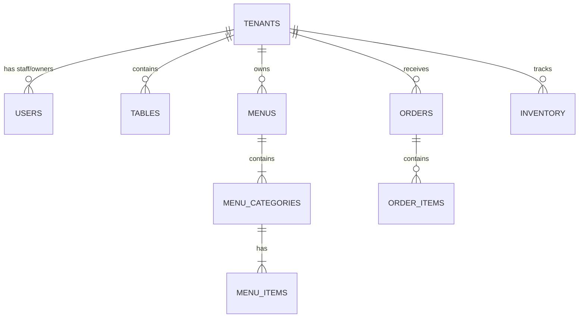

# Firestore Database Schema: RestaurantOS

RestaurantOS utilizes a shared-instance NoSQL model in Google Cloud Firestore. Logical partitioning is maintained via a tenant key (`tenantId`) indexed across all operational collections.

---

## 1. Data Model Overview



---

## 2. Collections and Document Details

### Collection: `tenants`
Stores the metadata, operational configurations, and billing statuses for each restaurant.

* **Path**: `/tenants/{tenantId}`
* **Schema**:
```typescript
interface ITenant {
  id: string;               // Unique restaurant slug or UUID
  name: string;             // Display name (e.g. "Gourmet Bistro")
  logoUrl: string;          // Banner or logo icon url in Firebase Storage
  planTier: 'starter' | 'pro' | 'enterprise';
  status: 'active' | 'suspended' | 'trial';
  address: {
    street: string;
    city: string;
    zipCode: string;
  };
  stripeCustomerId: string;
  stripeSubscriptionId: string;
  createdAt: string;        // ISO timestamp
  updatedAt: string;        // ISO timestamp
}
```
* **Security Rules**:
  - `read`: Publicly allowed (to check restaurant info and logo when loading a QR link).
  - `write`: Only users with `super-admin` roles, or tenant users with the role `owner` who authenticate against `tenantId`.

---

### Collection: `users`
Contains profiles and role claims for staff members and portal users.

* **Path**: `/users/{uid}`
* **Schema**:
```typescript
interface IUser {
  uid: string;              // Maps to Firebase Auth UID
  email: string;
  displayName: string;
  tenantId: string;         // Empty for global Super Admins
  role: 'super-admin' | 'owner' | 'admin' | 'waiter' | 'kitchen' | 'customer';
  status: 'active' | 'inactive';
  createdAt: string;
}
```
* **Security Rules**:
  - `read`: Authenticated users with the same `tenantId` can read (to list staff). Any user can read their own profile.
  - `write`: Only `owner`, `admin`, or `super-admin`.

---

### Collection: `menus`
Contains menu configuration documents. Categories and items are structured inside subcollections for isolation.

* **Path**: `/menus/{menuId}`
* **Schema**:
```typescript
interface IMenu {
  id: string;
  tenantId: string;
  name: string;             // (e.g. "Lunch Menu", "Happy Hour")
  isActive: boolean;
  createdAt: string;
}
```

#### Subcollection: `categories`
* **Path**: `/menus/{menuId}/categories/{categoryId}`
```typescript
interface ICategory {
  id: string;
  name: string;             // (e.g. "Starters", "Desserts")
  orderIndex: number;       // For UI sorting sequence
  isActive: boolean;
}
```

#### Subcollection: `items`
* **Path**: `/menus/{menuId}/items/{itemId}`
```typescript
interface IMenuItem {
  id: string;
  categoryId: string;       // Maps back to the category subcollection
  name: string;
  description: string;
  price: number;            // Stored in CENTS (e.g., 1250 for $12.50) to avoid floats
  imageUrl: string;
  allergens: string[];      // (e.g., ["Gluten", "Nuts"])
  isAvailable: boolean;     // Toggle for kitchen stock override
  customizationOptions: {
    name: string;           // (e.g. "Meat Cook Temperature")
    type: 'radio' | 'checkbox';
    minSelections: number;
    maxSelections: number;
    choices: {
      name: string;         // (e.g. "Medium Rare")
      priceModifier: number;// In cents (e.g. 200 for +$2.00)
    }[];
  }[];
}
```
* **Security Rules**:
  - `read`: Publicly allowed.
  - `write`: Restricted to tenant `owner` and `admin` roles.

---

### Collection: `orders`
Real-time operational orders database.

* **Path**: `/orders/{orderId}`
* **Schema**:
```typescript
interface IOrder {
  id: string;
  tenantId: string;
  tableId: string;          // Identifier of table scanning the QR code
  customerId: string;       // Optional, set if user registers/authenticates
  waiterId: string;         // Set if order is manually taken by table staff
  items: {
    itemId: string;
    name: string;
    count: number;
    notes: string;          // Customer specific item request
    selectedChoices: {
      optionName: string;
      choiceName: string;
      priceModifier: number;
    }[];
    pricePerUnit: number;   // Snapshotted price at order time in cents
  }[];
  subtotal: number;         // Sum of items * quantity + choice additions
  tax: number;
  total: number;            // Final checkout value in cents
  status: 'placed' | 'preparing' | 'ready' | 'served' | 'cancelled';
  paymentStatus: 'pending' | 'paid' | 'failed' | 'refunded';
  paymentMethod: 'stripe' | 'cash' | 'card_terminal';
  createdAt: string;
  updatedAt: string;
}
```
* **Security Rules**:
  - `read`: Customers matching `customerId`, or staff belonging to the respective `tenantId`.
  - `create`: Publicly writeable (anyone at a table can place an order).
  - `update`: Only tenant staff (`owner`, `admin`, `waiter`, `kitchen`).

---

### Collection: `tables`
Maintains seating arrangement coordinates and current service flags.

* **Path**: `/tables/{tableId}`
* **Schema**:
```typescript
interface ITable {
  id: string;
  tenantId: string;
  number: string;           // (e.g., "12", "Bar-4")
  seatingCapacity: number;
  status: 'empty' | 'occupied' | 'service_requested' | 'bill_requested';
  activeOrderId: string;    // Reference to current unpaid order document
  qrCodeUrl: string;        // Pre-generated hosting link
}
```
* **Security Rules**:
  - `read`: Public (to load table profiles).
  - `write/update`: Restricted to tenant staff. Customers can update `status` to `service_requested` or `bill_requested`.

---

### Collection: `inventory`
Tracks restaurant raw ingredients to warn kitchen staff when supplies run thin.

* **Path**: `/inventory/{ingredientId}`
* **Schema**:
```typescript
interface IInventoryItem {
  id: string;
  tenantId: string;
  name: string;             // (e.g., "Brioche Buns", "Ribeye Steak")
  stockLevel: number;       // Decimal or integer counts
  unit: 'pieces' | 'kg' | 'liters' | 'grams';
  reorderThreshold: number; // Emit low stock warnings if stockLevel <= threshold
  lastRestockedAt: string;
}
```
* **Security Rules**:
  - `read/write`: Restricted to tenant staff (`owner`, `admin`, `kitchen`).

---

## 3. Database Indexes

To support rapid sorting and dashboard aggregates, the following indexes must be provisioned in Firestore.

### Single-Field Index Overrides
- **`orders`**: Collection-group index on `customerId` for customer history searches.

### Composite Indexes

| Collection | Fields to Index | Query Scenario |
| :--- | :--- | :--- |
| **`orders`** | `tenantId` ASC, `status` ASC, `createdAt` DESC | Kitchen Dashboard active queue sorted by time |
| **`orders`** | `tenantId` ASC, `createdAt` DESC | Sales and reports metrics plotting over date ranges |
| **`menus/items`** | `categoryId` ASC, `isAvailable` ASC | Category layout menu render excluding depleted items |
| **`tables`** | `tenantId` ASC, `status` ASC | Waiter table dashboard filters |
