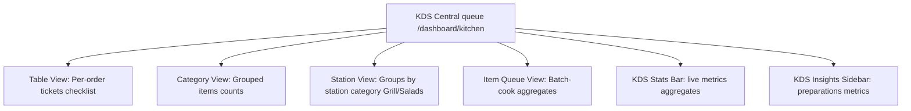

# Kitchen Display System (KDS): KDS Touchscreen Workspace

This document specifies the components, layout structures, and workflows of the touchscreen Kitchen Display System (KDS) of **RestaurantOS** (v2.0-rc).

---

## 1. Kitchen KDS Views

---

## 2. KDS Workspace Reference

### Table View (Default Queue)
* **Purpose**: Displays active orders as individual cooking ticket cards.
* **UI Features**:
  - **Live Elapsed Timers**: Timers color-code ticket age: Green (<5m), Yellow (5-15m), Pulsing Red (>15m).
  - **Item Checklist**: Interactive checkboxes for chefs to cross off prepared dishes.
  - **Estimated Preparation Time**: Displays calculated prep times with priority badges (VIP, Rush, Size).
  - **Chef Assignment Flow**: Dropdown to assign specific chefs to an order, pulling active staff from `/users` in real time.

### Category View
* **Purpose**: Groups pending items across orders by menu category (e.g. Starters, Dessert).
* **chems view**: Allows prep cooks to see how many soups, salads, or main dishes are pending across all active tables.

### Station View
* **Purpose**: Groups items by prep station (Grill, Fryer, Salads, Pizza) mapped from `IMenuItem.station` metadata.
* **Coordinating Stations**: Allows station chefs to focus only on items routed to their prep area.

### Item Queue View
* **Purpose**: Batch-cook aggregator compiling identical items.
* **Batch cooking**: Displays total counts (e.g. 5 Margherita Pizzas, 3 Biryanis) and a "Batch Cook" CTA to advance all matching items across tables at once.

### KDS Stats Bar (`KitchenStatsBar.tsx`)
Displays 8 real-time indicators:
1. **Active Tickets**: Count of unpaid orders.
2. **Preparing Tickets**: Orders in progress.
3. **Ready Pickup**: Tickets awaiting server collection.
4. **Avg Prep time**: Average time (MM:SS) to transition orders from placed to ready.
5. **Delayed Count**: Tickets exceeding the 15-minute preparation limit.
6. **Completed Today**: Total completed tickets.
7. **Kitchen Efficiency**: Percentage of tickets completed on time.
8. **Peak Queue size**: Max concurrent ticket volume.

### KDS Insights Sidebar (`KitchenInsightsPanel.tsx`)
* **Purpose**: Displays bottlenecks analysis.
* **Metrics**: Longest waiting item, fastest prep cook, main station bottleneck, average preparation delays, and active warning flags.

### Chef Controls & Pause States
* **Chef Assignment**: Dropdowns to assign or unassign chefs to orders.
* **Pause & Resume States**: Chefs can pause ticket preparation and select a reason (e.g. out of ingredients, custom details verification, power issue). Logs the pause event with reasons to the order timeline and updates the customer portal with a delayed notification.
* **Recall Ready Orders**: Allows chefs to pull back mistakenly completed orders, immediately updating the waiter's pickup list.
