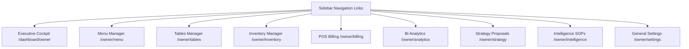

# Owner Dashboard: Executive Workspace

This document specifies the pages, layout structures, managers, and operational metrics of the desktop-first Owner Portal of **RestaurantOS** (v2.0-rc).

---

## 1. Owner Workspace Layout

---

## 2. Module Directory Reference

### Executive Cockpit Overview (`OwnerOverview.tsx`)
* **Purpose**: Serves as the owner's command cockpit.
* **KPI Widgets**: Displays Live Revenue, Average Order Value (AOV), active orders in progress, table occupancy percentages, and active diner counts.
* **Greetings Card**: Displays custom assessments (Morning/Midday/Evening) comparing real-time revenue pacing and operational speeds with trailing historical thresholds.
* **circular Health Gauge**: Integrates customer CSAT ratings, low stock warnings count, and kitchen prep ticket delays into a single unified health score (0-100).
* **Decision Feed**: Chronological list of events logs streamed from Firestore (shift float opens, safety stock warnings, cooking delays, and strategy updates).

### Menu Creator Workspace (`MenuManagement.tsx`)
* **Purpose**: Comprehensive menu management dashboard.
* **Sub-Tabs**:
  1. **Categories CRUD**: Edit category indexing orders, display names, and toggles.
  2. **Items CRUD**: Add dishes, set descriptions, upload Firebase Storage images, set allergens lists, and add customization choice option groups.
  3. **Availability Switchboard**: Real-time grid to flag menu items or categories out-of-stock.
  4. **Pricing Quick Editor**: Inline inputs to edit base and discount prices. Saves automatically on blur with validation rules (e.g. discount price < base price).
  5. **Diner Preview**: Interactive mobile layout preview of the menu.

### Seating Plan Canvas (`OwnerTablesManager.tsx`)
* **Purpose**: Interactive room and table coordinate arranger.
* **Visual Canvas**: A 2D grid where owners drag-and-drop table vectors representing circles, squares, or rectangles. Coordinates auto-save to Firestore in real time.
* **Exporters**: High-resolution canvas-based QR Code generator. Allows bulk exporting tables and printing cards with embedded tableside ordering links.

### Stock Intelligence (`OwnerInventoryManager.tsx`)
* **Purpose**: Comprehensive inventory control system.
* **Features**:
  - **Ingredient Master**: Setup ingredients tracking, unit measurements (`kg`, `pieces`, `liters`), cost points, shelf expiration limits, and supplier references.
  - **Recipe Mappings**: Link menu items to raw ingredient proportions.
  - **Low-Stock Alert Center**: Raises visual warning bells if items drop below reorder thresholds.
  - **Purchase Suggestions**: Asynchronously compile replenishment order forms.
  - **Waste Logs**: Track cost losses due to spoiled ingredients.

### Point-of-Sale Billing Desk (`OwnerBilling.tsx`)
* **Purpose**: Core register billing checkout management.
* **Sub-Tabs**: Open bills list, Open register float shifts, settled invoices history, returns & refunds log, sales summaries.
* **Rules Controls**: Supervisor PIN checks (`1234`) for high discount thresholds, complementary markdown markups, copy counts reprint audit logs, closed drawer cash checks.

### Business Analytics & Decisions (`OwnerAnalytics.tsx`)
* **Purpose**: Visual Business Intelligence dashboard.
* **SVG Visualizations**: Custom, pure-SVG line graphs for revenue trends, bar charts for item velocities, and heatmaps for peak seating hours.
* **multidimensional Filters**: Filter reports by Date range, Waiters, Tables, Menu Categories, and Payment Methods.

### Strategy Center (`OwnerStrategyCenter.tsx`)
* **Purpose**: Tracks strategic business recommendations.
* **Proposals**: Suggests marketing campaign deals, menu price optimizations, and scheduling adjustments based on metrics analysis, complete with estimated ROI.

### General Settings Tabs (`OwnerSettings.tsx`)
* **Purpose**: Configures restaurant settings.
* **Tabs**:
  1. **Profile**: Contact, logo uploads, address.
  2. **Hours**: Business working hours, holiday schedules.
  3. **Branding**: Dynamic primary colors selectors.
  4. **Currency & Timezone**: Regional options.
  5. **Taxes & Compliance**: Tax percentages, PAN/FSSAI, service charge overrides.
  6. **QR & Seating**: Table layout sections.
