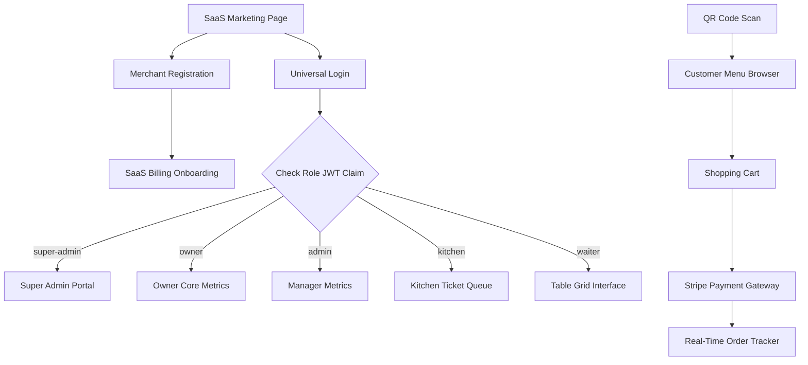

# Software Requirements Specification (SRS)

## Project: RestaurantOS
**Version**: 1.0.0  
**Date**: 2026-07-02  
**Status**: Approved  
**Author**: Lead Software Architect  

---

## 1. Executive Summary

RestaurantOS is a commercial-grade, multi-tenant SaaS Restaurant Management System. In the competitive food services industry, efficiency, speed, and accuracy are paramount to maintaining customer satisfaction and healthy profit margins. RestaurantOS solves operational fragmentation by unifying customer tableside ordering, waiter queue coordination, kitchen ticket operations, inventory control, and multi-tenant billing management into a single real-time platform.

The system relies on a high-availability serverless architecture utilizing Google Firebase and React. This document outlines the technical, functional, and organizational specifications that govern the implementation of RestaurantOS.

---

## 2. Product Vision

The vision of **RestaurantOS** is to serve as the default operating system for hospitality businesses worldwide. It replaces fragmented setups (separate POS terminals, paper ticketing, offline inventory binders, and independent websites) with a single, synchronized application state. By utilizing QR code scans, customers directly interface with the kitchen queue, reducing customer wait times and freeing waiters to focus on hospitality and quality assurance.

---

## 3. Business Goals

- **Increase Table Turnover Rates**: Decrease tableside order processing times by up to 25% through direct QR code ordering.
- **Minimize Order Accuracy Loss**: Direct customer-to-kitchen transmission eliminates transcription mistakes made by waiters.
- **SaaS Scalability**: Reach monthly recurring revenue (MRR) goals by offering three subscription tiers (Starter, Pro, Enterprise) with automated Stripe billing management.
- **Real-Time Workspace Provisioning**: Onboard new restaurants (tenants) automatically under 5 minutes from signup to live QR generation.
- **Data-Driven Optimizations**: Provide restaurant owners with actionable reports on peak hours, high-margin dishes, and staff speed.

---

## 4. Target Users

- **SaaS Platform Administrators (Super Admins)**: Responsible for global platform health, billing status, and merchant customer support.
- **Restaurant Owners**: Business executives who configure settings, analyze financial performance, manage subscription levels, and oversee human resources.
- **Restaurant Branch Managers**: Direct operations managers who adjust menu availability, oversee staff shifts, and inspect local inventory logs.
- **Wait Staff (Waiters)**: Floor team members who assign tables, take manual orders, split bills, and process physical payments.
- **Kitchen Crew (Chefs & Cooks)**: Culinary staff who receive order tickets, update cooking steps, and notify wait staff when food is ready.
- **Diners (Customers)**: Restaurant patrons who browse menu options, configure cart selections, pay via digital wallets, and track live order progress.

---

## 5. User Personas

### Alex - Super Admin (SaaS Platform Operator)
* **Demographics**: 34, technical systems operator.
* **Goals**: Maintain 99.9% uptime, monitor global SaaS margins, resolve tenant billing disputes quickly.
* **Pain Points**: Needs a central terminal view to identify tenants causing high database read/write spikes or credit card chargebacks.

### Sarah - Restaurant Owner (SaaS Client)
* **Demographics**: 42, owner of three boutique Italian restaurants.
* **Goals**: Monitor real-time profits across branches, optimize menus to push high-margin ingredients, reduce employee scheduling costs.
* **Pain Points**: Fatigued by keeping track of paper inventory binders and managing separate scheduling apps.

### Marcus - Restaurant Manager (Branch Supervisor)
* **Demographics**: 29, shift manager.
* **Goals**: Ensure smooth front-of-house operations, update menu items that are out of stock, approve employee schedules.
* **Pain Points**: Paper lists make updating "Daily Specials" slow when lunch crowds rush in.

### Chef Jin - Kitchen Head (Culinary Operator)
* **Demographics**: 45, professional chef.
* **Goals**: Cook dishes in order of entry, easily view item adjustments (allergies, side changes), mark orders complete without wiping greasy hands on paperwork.
* **Pain Points**: Loud paper printers frequently jam or get lost in steam-filled kitchens.

### Sofia - Floor Waiter (Service Representative)
* **Demographics**: 22, student working part-time.
* **Goals**: Check which tables need attention, enter custom orders for guests without smartphones, split tabs easily.
* **Pain Points**: Constantly running back and forth to a stationary POS terminal.

### Dave - Diner (Customer)
* **Demographics**: 27, tech-savvy professional.
* **Goals**: View menu photos, pay instantly without waiting for a waiter to bring a card reader, customize dishes (e.g. "no onions").
* **Pain Points**: Sitting at a table for 15 minutes before someone takes a beverage order.

---

## 6. Functional Requirements

### FR-01: Multi-Tenant Onboarding & Registration
- **FR-01.1**: The system must allow users to register a restaurant profile (name, phone, billing address, primary currency).
- **FR-01.2**: Upon registration, the system must trigger a Stripe Customer creation process and prompt the owner to select a subscription plan.
- **FR-01.3**: The system must automatically deploy a unique tenant subdomain or routing slug `/r/{tenantId}`.

### FR-02: User Authentication & Role-Based Access Control (RBAC)
- **FR-02.1**: The platform must support email/password sign-up and sign-in via Firebase Authentication.
- **FR-02.2**: The system must block access to dashboard routes `/dashboard/*` unless the user holds custom claims matching the route role.
- **FR-02.3**: Managers and Owners must be able to invite staff members by email, assigning their role (`admin`, `waiter`, `kitchen`).

### FR-03: QR Menu Browser & Customer Portal
- **FR-03.1**: Customers must be able to browse menu items grouped by categories without logging in.
- **FR-03.2**: The interface must adapt cleanly to all mobile devices (responsive design).
- **FR-03.3**: Menu items must display pricing, descriptions, allergy warning labels, and customization option groups.

### FR-04: Digital Cart & Checkout
- **FR-04.1**: The portal must support a local cart allowing users to modify item counts and select options (e.g. side selections).
- **FR-04.2**: The checkout system must allow payment processing using credit cards and digital wallets (Apple Pay, Google Pay) integrated via Stripe.
- **FR-04.3**: Orders paid at the table must mark their status as `Paid` in the database and push to the kitchen queue automatically.

### FR-05: Real-Time Order Management
- **FR-05.1**: Kitchen workers must see order tickets populate on their dashboard screen within 500ms of placement.
- **FR-05.2**: Cooks must be able to change order statuses (`Placed` -> `Preparing` -> `Ready for Pickup`).
- **FR-05.3**: Waiters must receive instant visual/sound alerts on their tablet when an order is flagged `Ready for Pickup`.

---

## 7. Non-Functional Requirements

### NFR-01: Reliability & Uptime
- **NFR-01.1**: The platform must target a 99.9% monthly uptime, utilizing Firebase Hosting's globally distributed CDN and Cloud Firestore's multi-region replication.
- **NFR-01.2**: The system must implement automated daily database snapshot backups.

### NFR-02: Security & Privacy
- **NFR-02.1**: All network traffic must run over HTTPS, using SSL certificates managed automatically by Firebase Hosting.
- **NFR-02.2**: Payment transactions must comply with PCI-DSS guidelines by delegating all card storage and transmission to Stripe Elements and Stripe SDKs.

### NFR-03: Usability
- **NFR-03.1**: The Customer Portal must achieve a Google Lighthouse accessibility score of 95 or above.
- **NFR-03.2**: The Kitchen Dashboard must display text at size parameters optimized for viewing on mounted screens from a distance of up to 2 meters.

---

## 8. Complete Feature List

### Customer Portal Features
- **Anonymous QR Browsing**: Instantly view the menu matching a table ID.
- **Item Customizer**: Modals allowing side replacements, add-on additions, and prep comments.
- **Persistent Cart**: Local storage cart that handles updates, deletes, and pricing updates.
- **Stripe Checkout**: Seamless tableside payment processing.
- **Live Status Tracker**: Watch order progress (Preparing, Ready) in real-time.
- **Request Service Button**: Send table service calls (e.g., "Request Water", "Request Bill") directly to the Waiter Dashboard.

### Waiter Dashboard Features
- **Table Grid Matrix**: Direct table monitoring showing statuses (Active, Occupied, Alert, Empty).
- **Manual Order Intake**: POS module for taking orders from tables without smartphone access.
- **Receipt Splitter**: Utility to divide totals equally or split specific dishes among guests.
- **Real-Time Request Feed**: Panel displaying tableside customer calls.

### Kitchen Dashboard Features
- **Ticket Queue Grid**: Interactive tickets sorted by placement time, highlighting modifications.
- **Status Progression Toggles**: Buttons to flag item prep updates.
- **Alert Indicator Sound**: Audio notifications on new orders.
- **Stock Depletion Switch**: Instant menu item disable options to toggle "Out of Stock" status.

### Owner Dashboard Features
- **Analytics Reports**: Graphical sales tracking, peak-hour calculations, and menu performance charts.
- **Menu Editor**: CRUD interface for menus, categories, and dishes with image uploads.
- **Staff Directory**: Employee invitations, role assignment, and schedule planning.
- **QR Code Exporter**: Automated layout generator creating print-ready PDFs with embedded table URLs.
- **Stripe Billing Panel**: Manage active SaaS tier and subscription cycles.

### Super Admin Dashboard Features
- **Platform Analytics**: Core SaaS metrics: Monthly Recurring Revenue (MRR), total active tenants, churn rates.
- **Tenant Management Directory**: Control settings to freeze, cancel, or extend merchant workspaces.
- **API Performance Metrics**: Monitor usage thresholds and cloud bill projections.

---

## 9. User Stories

1. **As a Diner**, I want to **scan the table QR code and select my food options**, so that **I can place my order immediately without waiting for a server**.
2. **As a Kitchen Chef**, I want to **see item adjustments highlighted in high-contrast text on the ticket grid**, so that **I don't cook allergy-sensitive items by mistake**.
3. **As a Waiter**, I want to **receive an audio alert when a table is flagged "Bill Requested"**, so that **I can bring the physical card reader to close their check quickly**.
4. **As a Restaurant Owner**, I want to **run daily sales reports showing the most popular items**, so that **I can plan next week's inventory orders**.
5. **As a Super Admin**, I want to **temporarily suspend a restaurant workspace due to failed billing attempts**, so that **the platform does not absorb unpaid Firestore resource usage**.

---

## 10. Use Cases

### Use Case 001: Table Ordering and Digital Payment
* **Actor**: Customer (Diner)
* **Preconditions**: Customer is seated at a table and scans the physical table QR code.

| Step | Action |
| :--- | :--- |
| **1** | Customer scans the QR code; the system parses the `tenantId` and `tableId` and displays the menu. |
| **2** | Customer adds menu items to the cart, selecting customization options. |
| **3** | Customer goes to the cart and clicks "Pay with Card". |
| **4** | Stripe checkout modal launches; customer inputs card info or authenticates Google/Apple Pay. |
| **5** | Payment success triggers. The system writes the order document to Firestore marked status `Paid`. |
| **6** | The system automatically pushes the order ticket to the Kitchen Dashboard. |

---

### Use Case 002: Menu Management and Item Availability Toggle
* **Actor**: Branch Manager or Kitchen Chef
* **Preconditions**: User is logged in with appropriate permissions for their tenant.

| Step | Action |
| :--- | :--- |
| **1** | User accesses the menu management dashboard. |
| **2** | User searches for a menu item (e.g., "Ribeye Steak"). |
| **3** | User toggles the "Is Available" switch to `false` due to ingredient depletion. |
| **4** | The system writes the availability change to the Firestore database document. |
| **5** | The Customer Portal updates immediately via live Firestore listeners, graying out the item. |

---

## 11. Role Permissions Matrix

All operations authenticate through Firebase Custom Claims verified via database rules.

| Collection | Super Admin | Owner | Manager | Waiter | Kitchen | Customer |
| :--- | :---: | :---: | :---: | :---: | :---: | :---: |
| **`tenants`** | CRUD | RU | R | - | - | R |
| **`users`** | CRUD | CRUD | CRU | R | - | - |
| **`menus`** | R | CRUD | CRUD | R | R | R |
| **`orders`** | R | CRUD | CRUD | CRUD | RU | C |
| **`tables`** | R | CRUD | CRUD | RU | - | RU |
| **`inventory`** | R | CRUD | CRUD | R | RU | - |

- **C**: Create
- **R**: Read
- **U**: Update
- **D**: Delete

---

## 12. Navigation Flow



---

## 13. Module Breakdown

### Core Modules & Sub-systems

#### 1. Tenant Workspace System
Handles domain routing mapping, configuration loads, and subscription plans synchronization. Uses `TenantContext` to query properties from the `/tenants` root.

#### 2. Ordering Engine
Processes item selections, maps customization modifications, computes taxes/totals in cents, handles checkout sessions, and writes order documents to Firestore.

#### 3. Shift and Employee Coordinator
Handles invitations, staff role modifications, schedule planning, and employee access validation.

#### 4. Real-Time Ticket Manager
Runs Firestore listeners linking active orders to the Kitchen and Waiter Dashboards. Manages state changes (`Preparing`, `Ready`, `Served`) and sound alerts.

#### 5. Inventory and Cost Tracker
Subtracts ingredient stock counts as orders are fulfilled, updates item listings, and displays warning alerts when stock runs low.

---

## 14. Security Requirements

- **Data Isolation**: Multi-tenant data isolation is logically enforced. All database query structures MUST query using the active `tenantId`.
- **Database Rules**: Firestore security rules restrict reads and writes based on custom user token claims (`tenantId`, `role`).
- **Data Encryption**: All data in transit is encrypted using TLS 1.3. Data at rest in Cloud Firestore and Firebase Storage is encrypted using AES-256.
- **Sensitive Operations Auditing**: Operations that modify staff roles, billing details, or menu configurations must write records to an immutable `/audit_logs` collection.

---

## 15. Performance Requirements

- **Page Load Speed**: Initial page loads must be under 1.5 seconds under standard LTE network connections.
- **Database Query Latency**: Real-time snapshot updates must reach active dashboards in under 200 milliseconds.
- **Optimized Asset Sizes**: Uploaded menu images must undergo client-side WebP compression to cap image sizes at 150KB before uploading to Firebase Storage.

---

## 16. Scalability Requirements

- **Serverless Scaling**: Leverage Firebase's automated horizontal scaling (Firestore and Hosting) to support spikes in user traffic.
- **Denormalized Database Design**: Store category names and item prices directly inside the `orders` document. This avoids complex join operations when loading transaction histories.
- **Stripe Webhooks**: Asynchronous billing changes are decoupled using Google Cloud Functions listening to Stripe events.

---

## 17. Multi-Tenant Requirements

- **Workspace Barriers**: A tenant user cannot access or read collections belonging to another tenant. This is enforced via Firestore Security Rules.
- **Resource Allocation Limits**: Limit resource creation based on the tenant's subscription tier:
  - *Starter*: 10 tables, 5 staff members, 1 branch location.
  - *Pro*: 50 tables, 20 staff members, 3 branch locations.
  - *Enterprise*: Unlimited tables, staff, and branch locations.

---

## 18. Firebase Service Requirements

### Firebase Auth
Utilized for secure token generation, login, and storing custom claims:
```json
{
  "role": "owner",
  "tenantId": "gourmet-bistro-1"
}
```

### Cloud Firestore
NoSQL storage. Must follow the specifications defined in `FIRESTORE_SCHEMA.md`.

### Firebase Storage
Asset hosting for menu images. The structure must organize media folders by tenant ID:
`/tenants/{tenantId}/menus/{menuId}/items/{itemId}.webp`

### Cloud Functions
Used for secure operations: Stripe session creations, Stripe payment webhooks, database garbage collections, and staff invite links.

---

## 19. UI/UX Principles

- **Contrast & Visibility**: Rely on high-contrast text ratios for readability in high-glare environments (e.g. tablet screens near kitchen lights).
- **Responsive Web Design**: All dashboards must adapt between mobile, tablet, and desktop views.
- **Micro-Animations**: Implement hover scaling and smooth transitions on active order tickets and cards to build a polished, modern interface.
- **Theme Standard**: A dark theme configuration featuring backdrop blurs and subtle gradient overlays to create a premium product feel.

---

## 20. Accessibility (a11y)

- **WCAG Standards**: All customer-facing screens must conform to WCAG 2.1 Level AA accessibility standards.
- **Semantic Structure**: Use correct interactive HTML elements (`button`, `a`, `input`, `select`) instead of custom-styled `div` layout clicks.
- **Keyboard Navigation**: Users must be able to select menu items, view carts, and trigger checkout using only keyboard controls (tabs and enter).
- **Alt Text**: All menu photos must contain fallback descriptive text.

---

## 21. Error Handling Strategy

- **Client Error Boundaries**: Wrap features inside React Error Boundaries to prevent a crash in one section (e.g., reports chart) from taking down the entire dashboard view.
- **User Alerts**: Display issues using toast notifications (errors in red, successes in green).
- **Network Failures**: Implement retry logic and offline caching for Firestore operations. The system must notify users when they are working offline.
- **Transactional Rollbacks**: Operations updating inventory or payment statuses must run inside Firestore Transactions to ensure data remains consistent in case of unexpected disconnects.

---

## 22. Logging Strategy

- **Client Errors Logger**: Send crash logs, uncaught exceptions, and performance metrics to an external logger (e.g. Sentry) or save them in a central logs collection.
- **Server Actions Log**: Write actions that modify database structures (e.g. staff invites, menu changes) to the `/audit_logs` collection.
- **Stripe Webhook Logs**: Maintain logs for Stripe webhook requests in Cloud Functions to simplify auditing subscription states and payment issues.

---

## 23. Analytics Requirements

- **SaaS Conversion Funnel**: Track visitor signups, subscription choices, onboarding steps, and first checkout completions.
- **Merchant Sales Dashboards**: Display key metrics to restaurant owners (average check value, popular dining hours, inventory levels).
- **Product Activity Logs**: Track user page views, QR scans, and average kitchen response speeds to identify UX bottlenecks.

---

## 24. Future Roadmap

### Phase 1: Foundations & Architecture (Months 1-2)
Vite setup, Firebase integration, multi-tenancy auth, base dashboard designs, database schemas.

### Phase 2: Operations & Real-Time Sync (Months 3-4)
Live Kitchen ticket board, Waiter seating layouts, QR code tableside order integration, staff management.

### Phase 3: Stripe Integrations & Billing (Months 5-6)
SaaS subscription plan management, customer checkout modules, Stripe onboarding.

### Phase 4: Reports, Analytics & Expansion (Months 7+)
Sales charting, inventory reorder engines, support for physical thermal printers, and AI-driven sales predictions.

---

## 25. Assumptions

- **Consistent Connectivity**: Restaurants will maintain a persistent internet connection (Wi-Fi or LTE) to ensure real-time dashboards sync properly.
- **Stripe Availability**: Merchant owners must reside in regions supported by Stripe payments.
- **Modern Browsers**: Diners will access the system through modern, standards-compliant browsers (Safari, Chrome, Firefox, Edge) that support HTML5 and WebRTC/WebSocket listeners.

---

## 26. Risks and Mitigations

| Risk | Impact | Severity | Mitigation Strategy |
| :--- | :--- | :---: | :--- |
| **Network Loss in Kitchen** | Kitchen staff miss new order alerts, causing customer delays. | **High** | The system will monitor network status. If disconnected, it will show a prominent warning banner and emit an alarm. |
| **Cross-Tenant Data Exposure** | A merchant accesses database records belonging to another tenant. | **Critical** | Restrict document access through Firestore Security Rules that validate custom JWT `tenantId` parameters. |
| **Stripe Service Outage** | Customers cannot process tableside digital payments. | **High** | Implement a "Pay at Counter" fallback option. This marks orders as `Unpaid` and routes them to the waiter dashboard for manual collection. |

---

## 27. Success Criteria

- **Zero Data Leaks**: Zero instances of tenant data exposure during security validation.
- **Response Speed**: 95% of database reads/writes complete in under 200ms.
- **Code Test Coverage**: Achieve at least 80% test coverage on shared logic helpers and custom Hooks.
- **High Customer Satisfaction**: Maintain a Stripe payment checkout success rate of 99.8% or above.
- **Fast Tenant Setups**: Complete tenant creation and onboarding in under 5 minutes.
