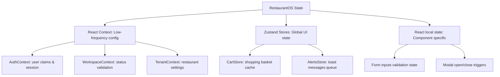

# State Management Strategy: RestaurantOS

This document specifies the global state stores, React contexts, local component state parameters, and caching rules of **RestaurantOS** (v2.0-rc).

---

## 1. State Partition Matrix

RestaurantOS partitions state into three logical layers to optimize performance and prevent unnecessary component re-renders.

---

## 2. Zustand Global Stores (Frontend State)

Zustand stores handle lightweight, global client-side state without the nesting boilerplate of React Context providers.

### Shopping Basket Store (`useCartStore`)
* **Purpose**: Manages customer cart selections during digital ordering.
* **Fields**:
  - `items`: Selected dishes with custom modifier options.
  - `tenantId` & `tableId`: Active table context identifiers.
* **Actions**: `addItem`, `removeItem`, `updateQuantity`, `clearCart`.
* **Caching**: Automatically synchronized with browser `localStorage` to preserve selections if a user accidentally reloads their mobile page.

### System Alerts Store (`useAlertsStore`)
* **Purpose**: Handles toast notification queues displayed across dashboards.
* **Actions**: `addAlert`, `dismissAlert`, `clearAll`.

---

## 3. React Context Providers (Security & Configs)

React Context is reserved for low-frequency configurations that mount at the root level.

### Authentication Context (`AuthContext.tsx`)
* **Purpose**: Streams active user credentials.
* **Source**: Listens directly to Firebase Auth `onAuthStateChanged`.
* **Details**: Decodes JWT Custom Claims (`role` and `tenantId`) and fetches the `/users/{uid}` profile, exposing session details to downstream guards.

### Workspace Validation Context (`WorkspaceContext.tsx`)
* **Purpose**: Enforces access boundaries for B2B dashboards.
* **Actions**: Validates employee activation state, checks restaurant status, and verifies Stripe subscription statuses.

### Restaurant Context (`RestaurantContext.tsx` & `TenantContext.tsx`)
* **Purpose**: Resolves tableside URL parameters and fetches the restaurant profile (`/tenants/{tenantId}`) to load branding themes dynamically.

---

## 4. Real-Time Snapshot State Synchronization

Real-time updates are driven by Firestore Snapshot listeners (`onSnapshot`).

* **Single Listener Pattern**: To optimize connection usage, components like `KitchenQueue.tsx` subscribe to the orders collection once. The loaded tickets array is saved in a single, in-memory reference, and the four dashboard sub-tabs (Table, Category, Station, Item Queue) process this array using client-side memoized filter functions.
* **Timer Counters**: Sub-components like `ElapsedTimer` use local `setInterval` hooks initialized on document creation timestamps, cleaning up on unmount to prevent memory leaks.
