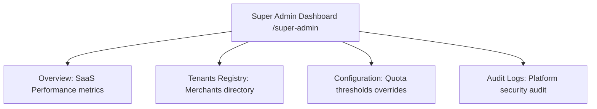

# Super Admin Dashboard: SaaS Operations

This document specifies the pages, layout structures, and tools available in the Super Admin Portal of **RestaurantOS** (v2.0-rc).

---

## 1. Super Admin Cockpit Layout

---

## 2. Feature Reference Directory

### Super Admin Overview (`SuperAdminOverview.tsx`)
* **Purpose**: Displays global SaaS indicators.
* **Platform Metrics**:
  - **Monthly Recurring Revenue (MRR)**: Aggregates active B2B subscription values.
  - **Active Tenants**: Total onboarded restaurant workspaces.
  - **Diner Volume**: Total orders processed across the platform.
  - **System Latency**: Average API write/read speeds.
* **Visual Charts**: Handcoded SVG bar charts tracking month-on-month merchant growth and MRR distributions.

### Tenants Registry (`SuperAdminTenants.tsx`)
* **Purpose**: Directory of all onboarded restaurants.
* **Actions**:
  - **Suspend Workspace**: Temporarily disables tenant databases access.
  - **Plan Tier Overrides**: Manually upgrades or downgrades tenant subscription plans.
  - **Bypass Billing Lockout**: Restores database access for suspended accounts to resolve payment issues.
  - **Seeding Presets**: Triggers automated demo presets database seeding ( Bella Italia or Sakura Ramen) to assist with customer demonstrations.

### Audit Log & Monitoring
* **Purpose**: Immutable security audit logging.
* **Logs Collection**: `/auditLogs`
* **Details**: Records critical actions (plan overrides, suspensions, database resets) with UIDs, timestamps, and action descriptions.
* **Rules Protection**: Read access is restricted to super-admins; write/update operations are disabled to prevent modification.
