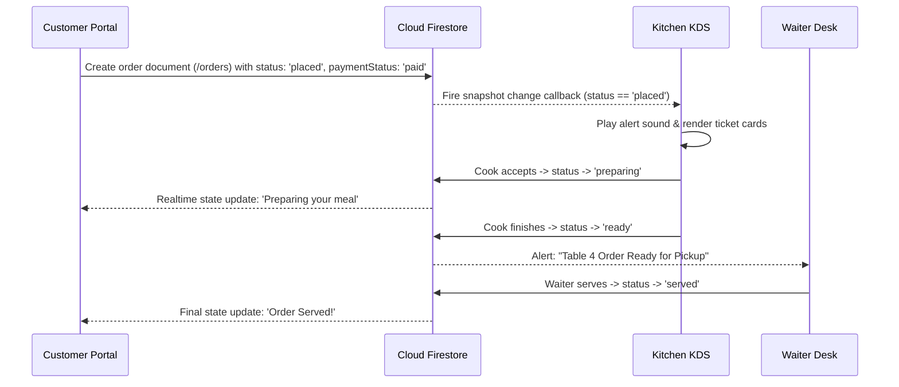
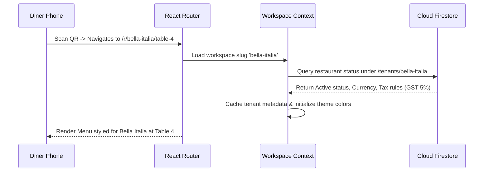
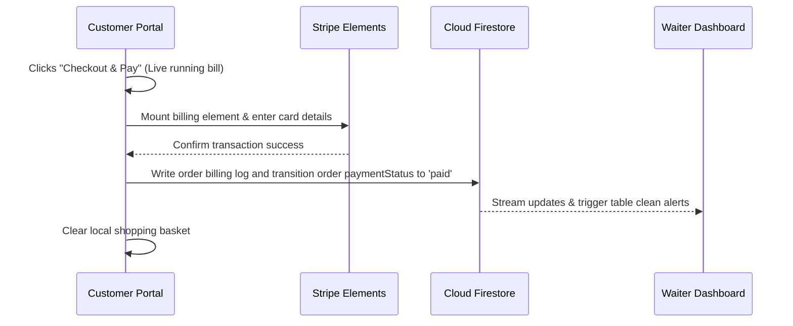
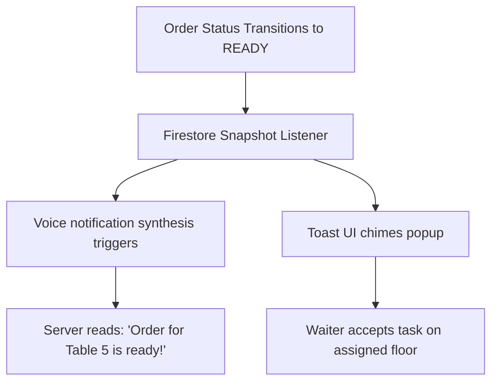
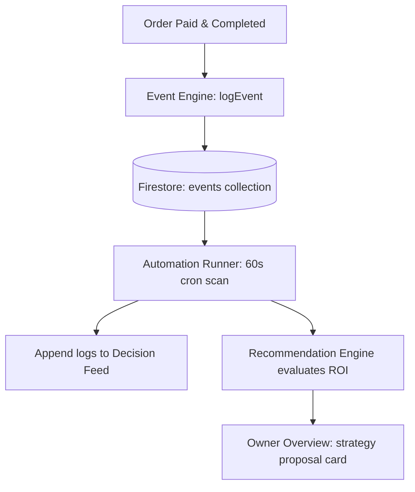

# System Architecture Specification: RestaurantOS

This document specifies the system architecture for **RestaurantOS** (v2.0-rc)—a multi-tenant, commercial-grade SaaS Restaurant Management System. This specification maps the frontend, backend, database models, real-time channels, and operational data flows.

---

## 1. High-Level System Architecture

```mermaid
graph TD
    subgraph Client-Side SPA (React App)
        UI[React Router / View Layer]
        Zustand[Zustand Stores - Cart, Alerts]
        Workspace[Workspace Validation Context]
        Auth[Auth Context & State Provider]
    end

    subgraph Hosting & CDN CDN
        FirebaseHosting[Firebase Hosting Edge CDN]
    end

    subgraph Firebase Serverless Core
        FirebaseAuth[Firebase Auth JWT]
        Firestore[Cloud Firestore NoSQL]
        CloudStorage[Firebase Storage Media]
    end

    subgraph Background Analytics & Automation
        EventEngine[Event Engine Stream Logger]
        AutomationRunner[Automation Service Engine]
        RecommendationEngine[Recommendation Rules Engine]
    end

    subgraph External Services Integration
        StripeAPI[Stripe Payments API Elements]
    end

    UI -->|Deploys to| FirebaseHosting
    UI -->|Session Validation| FirebaseAuth
    UI -->|CRUD & Snapshot Listeners| Firestore
    UI -->|Upload Logo / Menu Images| CloudStorage
    UI -->|Redirect Checkout & Subscription| StripeAPI
    Firestore -->|Asynchronous Trigger Logs| EventEngine
    EventEngine -->|Evaluation Trigger| AutomationRunner
    AutomationRunner -->|Compute Strategies| RecommendationEngine
```

---

## 2. Frontend Architecture

The frontend is built as a single-page application (SPA) using React 18, TypeScript, and Vite. The codebase is organized into client portals (`src/apps/`) and a centralized library (`src/shared/`).

### App Partitioning
1. **Customer Portal (`apps/customer/`)**: Optimized for mobile browser responsiveness, allowing diners to scan tableside QR codes, browse menus, add custom modifiers, compile shopping baskets, process Stripe payments, and track preparation statuses in real time without account creation.
2. **Owner Dashboard (`apps/owner/`)**: Desktop-first executive cockpit. Includes the menu editor workspace, seating plan drag-and-drop coordinator, staff roster boards, automated schedulers runner, and analytics dashboards.
3. **Super Admin Dashboard (`apps/super-admin/`)**: Platform admin portal to manage tenant subscriptions, billing limits, and workspace suspensions.

---

## 3. Backend Architecture

The system uses a serverless cloud model powered by **Google Firebase**. The client React application establishes direct socket connections to Firebase Core APIs, eliminating intermediate backend API controller layers.

- **Authentication Service**: Handled by Firebase Auth, validating staff email credentials or customer anonymous sessions and issuing JWTs.
- **Database Service**: Cloud Firestore provides JSON document-based storage. All queries are partitioned logically using an indexed `tenantId` parameter.
- **Security Interceptor (Rules)**: Gated via `firestore.rules`. Firestore evaluates permissions on the database engine itself before processing client operations.
- **Background Event Engine**: Emits asynchronous transaction and audit logs to the `/events` collection. An in-memory automation runner checks business rules and updates metrics continuously.

---

## 4. Realtime Channels & Operational Flows

### 📲 Order Lifecycle Flow


### 💁 Tableside QR & Session Initialization Flow


### 💳 Tableside Checkouts & Stripe Payments Flow


### 🔔 Realtime Notification Flow


### 📈 Analytics & Automated Strategy Pipeline


---

## 5. State Management & Data Pipeline

State management is partitioned into three logical scopes:
1. **React State (`useState`, `useReducer`)**: Manages localized component conditions (such as dialog toggles, active filter tabs, or inline inputs text values).
2. **Zustand Global Stores**: Manages front-end states that persist across portals but do not require database connections (such as the persistent `useCartStore` cached in `localStorage`, and toast messages queues).
3. **React Context Providers**: Manages application-wide configurations that load once on initialization (such as `AuthContext` user metadata, `TenantContext` theme variables, and `WorkspaceContext` security parameters).

### Caching Strategy
- **Firestore Offline Persistence**: Enabled during Firebase configuration. If a waiter tablet loses Wi-Fi connection, operations queue in local IndexedDB storage and upload automatically when the connection restores.
- **Memoized Metrics**: Heavy calculations inside KDS screens and Analytics tables (such as Average Prep Times or Sales Aggregates) are wrapped in `useMemo` hooks to prevent UI lag.
