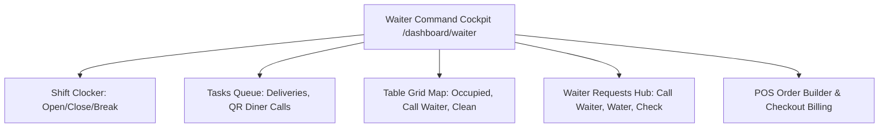

# Waiter Dashboard: Service Command Center

This document specifies the features, layout structures, and workflows of the waiter dashboard of **RestaurantOS** (v2.0-rc).

---

## 1. Waiter Cockpit Layout

---

## 2. Feature Reference Directory

### Seating Grid Map (`WaiterMatrix.tsx`)
* **Purpose**: Displays table occupancy status, seating capacity, and pending requests in real time.
* **Table Occupancy Indicators**:
  - **Green (Available)**: Empty table. Waiter can click to check-in guests (enters party size) or reserve the table.
  - **Blue (Occupied)**: Active dining table. Displays active order totals.
  - **Red (Alert)**: Seated diner has called for assistance.
  - **Yellow (Cleaning)**: Diner checked out. Table requires resetting to available state.

### Shift Clocker & Tracker
* **Purpose**: Logs shifts, breaks, and served tables.
* **States**: `Clocked Out` -> `Clocked In` -> `On Break` -> `Clocked In`.
* **Business Logic**: Computes serving durations and tables turnaround averages dynamically.

### Dynamic Tasks Queue
* **Purpose**: Consolidates daily tasks.
* **Task Routing & Optimization**: Uses an optimal routing algorithm sorting tasks by urgency, location, and section proximity to suggest the next best action.
* **Precision Timers**: Displays color-coded countdowns indicating task age (escalates to red flashing if unresolved for over 2 minutes).

### Waiter Requests Hub (`WaiterAlerts.tsx`)
* **Purpose**: Handles tableside assistance requests.
* **Sub-Tabs**:
  1. **Pickup Alerts**: Displays orders marked `READY` by the kitchen KDS. Waiters click "Mark Delivered" to complete the loop.
  2. **Assistance Requests**: Lists tableside calls (Call Waiter, Water, Bill, Help). Waiters click "Accept" (marks request in progress) and "Complete" (clears request and table alert state).

### Point-of-Sale Checkout Drawer
* **Purpose**: Allows waiters to check out tables manually.
* **Billing Summary**: Computes totals, taxes, and service charges. Allows adding cash payment methods or manual discount sliders before clearing the table.

### Handover Coordinator (`WaiterShiftReportPage.tsx`)
* **Purpose**: Coordinates shift handovers between servers.
* **Business Logic**: Waiters must select an oncoming staff member to transfer their assigned tables. Creates a log under `/handovers` to track the transfer of open checks.
